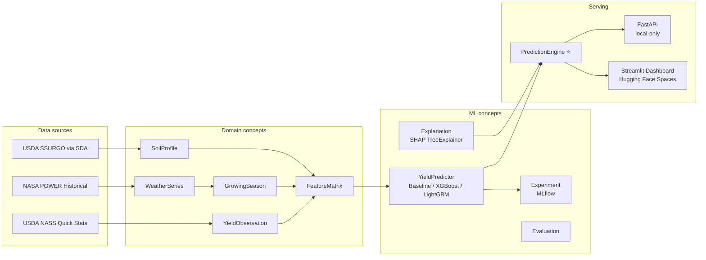

# CropIQ — County-Level Corn Yield Forecasting

End-to-end ML pipeline: USDA NASS yields × NASA POWER weather × USDA SSURGO soil,
modeled with XGBoost, evaluated with strict time-based cross-validation, explained
with SHAP, served via FastAPI (local) and a Streamlit dashboard deployed to
Hugging Face Spaces.

**Live demo:** <https://huggingface.co/spaces/charanyellanki/cropiq>
**Source:** <https://github.com/charanyellanki/CropIQ>

---

## Results

| Model    | Val RMSE | Test RMSE | Test MAPE | Test R² | vs Baseline |
|----------|---------:|----------:|----------:|--------:|------------:|
| Baseline | _filled in by `reports/results.md`_ |  |  |  | — |
| XGBoost  |          |           |           |         |             |
| LightGBM |          |           |           |         |             |

Per-state and per-year breakdowns plus SHAP-driven plots live in
[`reports/results.md`](reports/results.md) and `reports/figures/`.

## Architecture



The `PredictionEngine` is the single source of truth for inference — both the local
FastAPI service and the deployed Streamlit dashboard delegate to it in-process.

## Quickstart (local)

```bash
git clone https://github.com/charanyellanki/CropIQ.git
cd CropIQ
cp .env.example .env             # add NASS_API_KEY (NOAA_TOKEN optional)
python3.11 -m venv .venv && source .venv/bin/activate
make install

make all                          # data → train → eval → gates
make serve                        # FastAPI on :8000 (local-only)
make dashboard                    # Streamlit on :8501
```

## Deploy to Hugging Face Spaces

See [`docs/deploy_hf.md`](docs/deploy_hf.md). TL;DR:

```bash
git remote add space https://huggingface.co/spaces/<username>/cropiq
git push space main
```

The Space picks up the `requirements.txt`, runs `streamlit run app.py`, and serves
the dashboard at `https://huggingface.co/spaces/<username>/cropiq`.

## Methodology — AIDLC

The build follows the 8-phase **AI Development Life Cycle** plus two deployment
phases, each gated by an automated assertion (`scripts/run_gate.py <phase>`):

- **Phase 0 — Setup:** dependencies, configuration, gate runner.
- **Phase 1 — Problem Framing:** [`docs/problem_card.md`](docs/problem_card.md).
- **Phase 2 — Data Acquisition:** USDA NASS / NASA POWER / USDA SSURGO.
- **Phase 3 — Data Understanding:** `notebooks/01_eda.ipynb`, [`docs/data_card.md`](docs/data_card.md).
- **Phase 4 — Data Preparation:** `FeatureMatrix.build` → `data/processed/features.parquet`.
- **Phase 5 — Modeling:** Baseline → XGBoost → LightGBM, all logged to MLflow.
- **Phase 6 — Evaluation:** SHAP drivers + per-state/year breakdowns → `reports/results.md`.
- **Phase 7 — Local Deployment:** `PredictionEngine` + FastAPI + Streamlit.
- **Phase 8 — Governance:** [`docs/model_card.md`](docs/model_card.md), [`docs/limitations.md`](docs/limitations.md).
- **Phase 9 — README + Polish:** this file.
- **Phase 10 — HF Spaces Deploy:** [`docs/deploy_hf.md`](docs/deploy_hf.md).

## Concept architecture

Codebase organized around **concepts** in the [Daniel Jackson sense](https://essenceofsoftware.com/),
adapted for ML. Each concept lives in its own module under [`src/concepts/`](src/concepts/)
with a docstring stating its purpose, state, actions, and operational principle.
Synchronizations between concepts are explicit; see [`CLAUDE.md §6`](CLAUDE.md).
The shared core for inference, `PredictionEngine`, lives in [`src/inference/`](src/inference/).

## Agronomic insight

The trained model's top SHAP drivers consistently surface the agronomic signals you
would expect for Midwest corn: July precipitation, the V6-to-VT growing-degree-day
total, July tmax, and soil organic matter. See `reports/results.md` for the full
written interpretation.

## Limitations

See [`docs/limitations.md`](docs/limitations.md). In brief: county granularity, no
satellite imagery, no management or hybrid information, two test years only.

## Tech stack

`Python 3.11` · `pandas 2.2` · `pyarrow 17` · `pydantic 2` · `XGBoost 2.1` ·
`LightGBM 4.5` · `SHAP 0.46` · `MLflow 2.17` · `FastAPI 0.115` ·
`Streamlit 1.40` · `Plotly 5.24`. Pinned versions tested compatible on Hugging
Face Spaces; see [`requirements.txt`](requirements.txt).

## License

MIT.
